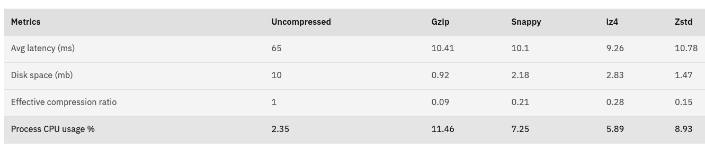

## Solution

* sample cdc events: `stream.jsonl`
* `org.konnect.KafkaWriter` ingests sample cdc events into `cdc-events` Kafka topic
* `org.konnect.ESWriter` persists the data from Kafka topic into Opensearch index `cdc`


### Execution

- start cluster(s)
  ```shell
  docker --version     
  # Docker version 27.5.1, build 9f9e405
  
  docker compose up -d  # somehow docker-compose is not available in my env
  ```
- execute processes:
  - compile project: `mvn clean compile`
  - execute Kafka publisher: `mvn exec:java -Dexec.mainClass="org.konnect.KafkaWriter"`

    Verify using `kcat -b localhost:9092 -C -t cdc-events`, or
    from [Kafka UI](http://localhost:8080/ui/clusters/local/all-topics?perPage=25)
  - write to Opensearch: `mvn exec:java -Dexec.mainClass="org.konnect.ESWriter"`

    Verify using `curl localhost:9200/cdc/_search | less` or
    from [Opensearch dashboard](http://localhost:5601/app/opensearch_index_management_dashboards#/index-detail/cdc)

- teardown using `docker compose down`

### External dependencies

External dependencies used:

- Kafka Java client
- Opensearch Java client
- slf4j logging library

### Notes

#### File reader

Uses `RandomAccessFile#readline` to stream through input file - it does not load the entire file in memory. Hence, it
can work with files which are much larger than memory.

##### Possible improvements

- **mmap + chunked reading in parallel**: if file is large, then it can be chunked into multiple parts, memory map each
  chunk, then read the chunks in parallel from different threads. For the current problem, the given file is tiny and
  hence these steps were not attempted. Multi-threading overhead and complexity is justified when file is really large (
  example - check [1BRC solutions](https://questdb.com/blog/billion-row-challenge-step-by-step/) - it involves
  aggregating 1 billion rows, every solution involves mmap and multi-threaded processing).
- **batched reading + object reuse + better API**: If I understand correctly, `RandomAccessFile#readline` reads a byte
  at a time - reading in batch (say, 8k at a time) would be more efficient; also it internally uses a new
  `StringBuilder` instance for each invocation - this is extremely wasteful 😭; it can enable reuse with better API, as
  suggested:
  ```java
  // client code
  var buffer = new ByteArrayBuilder();    // similar semantics to StringBuilder
  var raf = new RandomAccessFile("/path/to/file", "r");
  
  while(predicate) {
      buffer.setLength(0);  // reset the buffer
      raf.readLineInto(buffer);
      process(buffer, /*offset*/ 0, /*length*/ buffer.length);
  }

  // in RandomAccessFile class
  public void readLineInto(ByteArrayBuilder buffer) {
      // read a line as byteArray - not UTF8 string
  }
  ```

#### Kafka Publisher

- batched writes: messages are written in LZ4 compressed batches - a `batch.size` of 32kb is used (instead of default
  16kb).
- why lz4: multiple compression methods are supported by Kafka - but I believe lz4 is most suitable for current
  workloads.  
  Reference: [Message compression in Apache Kafka](https://developer.ibm.com/articles/benefits-compression-kafka-messaging/)  

  LZ4 has lowest latency and least CPU usage - as of this writing, we have effectively infinite disk capacity thanks to
  cloud object storage; data center networks are ~10 GBps or more; but CPU is limited - CPU is the current bottleneck.  
  Because of this, lz4 is favoured over other compression schemes.

##### Possible improvements

- monitoring: Kafka publishers expose a lot of [metrics](https://kafka.apache.org/documentation/#producer_monitoring);
  these are inputs towards effective publisher tuning.
- in a real world scenario, there would be more than 1 partition - that might require custom partitioning logic
- **binary** payload: what we have now is wasteful
  ```text
    byte[]  ----- deserialize ------> app format ----- serialize ----> byte[]
  network/disk                                                   network/publisher/broker
  ```
  What we should aim for:
  ```text
    byte[]  ----- [app works on byte[] flyweights] ----> byte[]
  network/disk                                         network/publisher/broker
  ```
  Example: [Principles behind SBE](https://weareadaptive.com/trading-resources/blog/design-principles-for-sbe-the-ultra-low-latency-marshaling-api/),
  SBE/Protobuf/avro for serializing data

#### Kafka Consumer

- monitoring: Kafka exposes a LOT of [consumer metrics](https://kafka.apache.org/documentation/#consumer_monitoring)
- since dealing with only 1 partition, no rebalance logic were implemented

#### Opensearch

Using bulk indexing to increase indexing performance.  
Opensearch docs are - sorry to say - awful; many details are missing; had to dig into elasticsearch docs.  
Example: opensearch bulk code fragments dont work for json data - had to use
this: [Indexing raw JSON data](https://www.elastic.co/guide/en/elasticsearch/client/java-api-client/current/indexing-bulk.html#indexing-raw-json-data)

##### Viable alternative: Druid for text search?

- Druid supports rudimentary text search in
  columns: [search queries](https://druid.apache.org/docs/latest/querying/searchquery/)  
  At Conviva, we used `contains` and `regex` a lot; `regex` turned out to be fairly expensive and users would abuse it
  as well - so restricted use of `regex`
- Druid segment format can be extended to support
  full [Lucene based text-search](https://www.slideshare.net/slideshow/druid-meetup-5th/81262812) 
