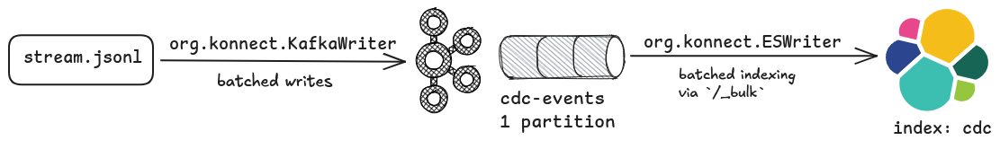

## Solution

* sample cdc events: `stream.jsonl`
* `org.konnect.KafkaWriter` ingests sample cdc events into `cdc-events` Kafka topic
* `org.konnect.ESWriter` persists the data from Kafka topic into Opensearch index `cdc`



### Execution

- start cluster(s)
  ```shell
  docker --version     
  # Docker version 27.5.1, build 9f9e405
  
  docker compose up -d  # somehow docker-compose is not available in my env
  ```
- execute processes:
  - compile project: `mvn clean compile`
  - execute Kafka publisher: `mvn exec:java -Dexec.mainClass="org.konnect.KafkaWriter"`

    Verify using `kcat -b localhost:9092 -C -t cdc-events`, or
    from [Kafka UI](http://localhost:8080/ui/clusters/local/all-topics?perPage=25)
  - write to Opensearch: `mvn exec:java -Dexec.mainClass="org.konnect.ESWriter"`

    Verify using `curl localhost:9200/cdc/_search | less` or from [Opensearch dashboard](http://localhost:5601)

- teardown using `docker compose down`

### External dependencies

External dependencies used:

- Kafka Java client
- Opensearch Java client
- slf4j logging library

### Notes

#### File reader

Uses `RandomAccessFile#readline` to stream through input file - it does not load the entire file in memory. Hence, it
can work with files which are much larger than memory.

Possible improvements

- **mmap + chunked reading in parallel**: if file is large, then it can be chunked into multiple parts, memory map each
  chunk, then read the chunks in parallel from different threads. For the current problem, the given file is tiny and
  hence these steps were not attempted. Multi-threading overhead and complexity is justified when file is really large (
  example - check [1BRC solutions](https://questdb.com/blog/billion-row-challenge-step-by-step/) - it involves
  aggregating 1 billion rows, every solution involves mmap and multi-threaded processing).
- **batched reading + object reuse + better API**: If I understand correctly, `RandomAccessFile#readline` reads a byte
  at a time - reading in batch (say, 8k at a time) would be more efficient; also it internally uses a new
  `StringBuilder` instance for each invocation - this is extremely wasteful 😭; it enable reuse with better API, as
  suggested:
  ```java
  // client code
  var buffer = new ByteArrayBuilder();    // similar semantics to StringBuilder
  var raf = new RandomAccessFile("/path/to/file", "r");
  
  while(predicate) {
      buffer.setLength(0);  // reset the buffer
      raf.readLineInto(buffer);
      // process the buffer/byteArray
  }

  // in RandomAccessFile class
  public void readLineInto(ByteArrayBuilder buffer) {
      // read a line as byteArray - not UTF8 string
  }
  ```

#### Kafka Publisher
